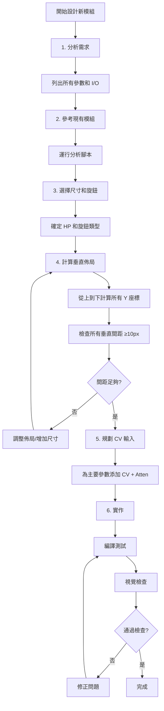

# weiiidocumenta 模組佈局設計錯誤記錄

**模組**: weiiidocumenta (錄音取樣器)
**設計時間**: 2025-11-06
**最終尺寸**: 8HP

---

## 錯誤時間線

### 錯誤 #1: 使用不正確的標籤偏移值 (+15px)
**時間**: 初始設計
**問題**:
- 使用 +15px 作為旋鈕標籤偏移
- 用戶指出：「問題是+15根本就會被旋鈕擋住，你到底在哪裡看到+15可以用的」

**原因分析**:
- 沒有系統性分析現有模組的真實偏移值
- 憑感覺猜測偏移值
- 忽略了旋鈕半徑會遮蓋標籤

**正確做法**:
- 應該先運行 `analyze_by_knob_type.py` 分析所有模組
- 根據旋鈕類型和模組密度選擇正確偏移
- WhiteKnob (30px): +24px 或 +25px
- MediumGrayKnob (26px): +24px
- 不同密度模組使用不同偏移（緊湊 +20px, 中等 +24px, 寬鬆 +25px）

---

### 錯誤 #2: 只檢查標籤到控制的偏移，沒檢查控制底部到下一個標籤的間距
**時間**: 第一次修正後
**問題**:
- GAIN 旋鈕在 Y=128 (底部 Y=143) 到 HPF 標籤在 Y=138 = **-5px 重疊**
- 用戶指出：「你估算都沒有往下方看，有一些上排功能距離下排功能的文字太接近了」

**原因分析**:
- 只計算了「標籤Y → 控制Y」的偏移
- 沒有計算「控制Y + 半徑 → 下一個標籤Y」的間距
- 忽略了垂直方向的整體佈局密度

**正確做法**:
```python
# 計算公式
control_bottom = control_y + knob_radius
next_label_y = control_bottom + min_spacing  # min_spacing 至少 10px
```

**計算範例** (WhiteKnob 30px):
```
標籤 Y=100
旋鈕 Y=100+24=124 (中心)
旋鈕底部 Y=124+15=139
下一個標籤 Y=139+10=149 (最小間距)
```

---

### 錯誤 #3: I/O 區域元素重疊
**時間**: 12HP 初始佈局
**問題**:
- SLICE 和 GATE 插孔放在 X=60 (中間)，與兩側列重疊
- 用戶指出：「最下面的佈局還是錯啊 你確定你看不到有元件疊在一起嗎」

**原因分析**:
- 使用 3 列佈局 (X=30, 90, 150) 但試圖放 6 個插孔
- 沒有規劃好 X 座標的網格系統
- 隨意插入中間位置導致重疊

**正確做法**:
- 明確定義網格系統 (8HP: 2列, 12HP: 3列)
- 所有元素必須對齊網格
- 元素數量超過網格列數時，使用上下兩排而非增加列

---

### 錯誤 #4: 錯誤估計 8HP 容量
**時間**: 設計中期
**問題**:
- 認為 8HP 無法容納所有控制，建議刪減功能
- 用戶指出：「你放屁，8HP完全就放得下三排控制，甚至我有模組放四排的」

**原因分析**:
- 沒有參考用戶現有的 8HP 模組 (EuclideanRhythm, MADDY)
- 低估了緊湊佈局的可能性
- 沒有考慮使用較小的旋鈕 (26px) 和小字體

**正確做法**:
- 參考現有 8HP 模組的最大密度
- 使用 MediumGrayKnob (26px) 而非 StandardBlackKnob (30px)
- 使用較小字體 (6-7pt)
- 採用 2 列 × 多排的網格佈局

---

### 錯誤 #5: 同一模組內使用不一致的偏移值
**時間**: 8HP 初版
**問題**:
- 大部分控制使用 +25px
- MORPH 區塊使用 +13px
- 用戶指出：「我們應該要先檢討為什麼你大部分用+25, 可是morph居然用+13?」

**原因分析**:
- 發現空間不夠時，臨時改用較小偏移
- 沒有從一開始就規劃統一的偏移值
- 缺乏整體佈局規劃

**正確做法**:
- **整個模組必須使用統一的偏移值**
- 如果空間不夠，應該：
  1. 調整整體佈局間距
  2. 考慮增加模組寬度 (8HP→12HP)
  3. 移除次要功能
- 不應該在某個區塊單獨使用不同偏移

---

### 錯誤 #6: 使用錯誤的旋鈕類型
**時間**: 8HP 修正版
**問題**:
- 使用 `StandardBlackKnob26`, `Trimpot`, `SnapKnob`
- 用戶指出：「你又犯了文字兼具不一的問題，而且我說過要用我的白色與灰色旋鈕的設計」

**原因分析**:
- 沒有查看 `src/widgets/Knobs.hpp` 中的標準旋鈕定義
- 不清楚用戶已經定義好的旋鈕系統：
  - `WhiteKnob` (30px): 白色內圈 + 粉紅指示器
  - `MediumGrayKnob` (26px): 灰色內圈 + 白色指示器
  - `MADDYSnapKnob` (26px): Snap 版本的灰色旋鈕

**正確做法**:
- 先檢查 `src/widgets/Knobs.hpp` 了解可用旋鈕
- 使用用戶定義的標準旋鈕
- 主要參數用 WhiteKnob (醒目)
- 次要參數用 MediumGrayKnob
- 離散參數用 MADDYSnapKnob

---

### 錯誤 #7: 波形顯示與按鈕間距不足
**時間**: 最終版本
**問題**:
- 波形顯示底部 Y=28+37=65
- 按鈕標籤 Y=70
- 間距只有 5px，太緊湊
- 用戶指出：「三個按鈕都要往下5px, 請檢討為什麼」

**原因分析**:
- 沒有檢查波形顯示的底部位置
- 視覺元素之間需要更多呼吸空間
- 應該留至少 10px 間距

**正確做法**:
```cpp
// 波形顯示
display_bottom = 28 + 37 = 65
// 最小間距 10px
button_label_y = 65 + 10 = 75
button_y = 75 + 15 = 90  // 按鈕偏移較小
```

---

### 錯誤 #8: I/O 區域佈局不符合用戶標準
**時間**: 最終版本
**問題**:
- 沒有參考 U8 模組的 I/O 佈局 (左邊 Input, 右邊 Output)
- 沒有參考 TWNC2 的標籤放置方式 (標籤在插孔左邊)
- 沒有為所有功能添加 CV Input + Attenuverter

**正確做法** (參考 EuclideanRhythm):
```cpp
// 每個參數都應該有：
// 1. 主旋鈕
addParam(createParamCentered<MediumGrayKnob>(Vec(x, y), module, PARAM));
// 2. CV 輸入 (在旋鈕下方)
addInput(createInputCentered<PJ301MPort>(Vec(x, y+22), module, CV_INPUT));
// 3. Attenuverter (在 CV 輸入下方)
addParam(createParamCentered<Trimpot>(Vec(x, y+44), module, ATTEN_PARAM));
```

**I/O 區域佈局** (參考 U8):
```cpp
// 左側: 所有 Input
addInput(..., Vec(15, 343), ..., AUDIO_INPUT_L);
addInput(..., Vec(15, 368), ..., AUDIO_INPUT_R);

// 右側: 所有 Output
addOutput(..., Vec(105, 343), ..., OUTPUT_L);
addOutput(..., Vec(105, 368), ..., OUTPUT_R);
```

---

## 核心教訓總結

### 1. **永遠先分析，不要猜測**
- ❌ 錯誤: 猜測標籤偏移是 +15px
- ✅ 正確: 運行 `analyze_by_knob_type.py` 分析真實數據

### 2. **檢查垂直方向的所有間距**
```python
# 必須檢查的間距：
1. 標籤到控制 (label_y → control_y)
2. 控制到下一個標籤 (control_y + radius → next_label_y)  ← 常被忽略！
3. 區塊標題到控制
4. 視覺元素之間 (如波形顯示到按鈕)
```

### 3. **統一性是關鍵**
- 整個模組使用**相同的偏移值** (如 +24px)
- 整個模組使用**相同的字體大小** (如 7pt)
- 使用**統一的旋鈕系統** (WhiteKnob/MediumGrayKnob/MADDYSnapKnob)

### 4. **參考現有模組**
需要參考的模組清單：
- **8HP 緊湊佈局**: EuclideanRhythm, MADDY
- **I/O 區域**: U8 (左 Input 右 Output)
- **標籤位置**: TWNC2 (標籤在插孔左邊)
- **CV + Attenuverter**: EuclideanRhythm (完整範例)
- **旋鈕類型**: MADDY, MADDYPlus (WhiteKnob/MediumGrayKnob 用法)

### 5. **完整的佈局檢查清單**

```markdown
## 新模組佈局檢查清單

### 尺寸規劃
- [ ] 確定 HP 尺寸 (4/8/12/40)
- [ ] 計算可用垂直空間 (標題區到 Y=330 白色區)
- [ ] 確定網格列數 (8HP=2列, 12HP=3列)

### 旋鈕選擇
- [ ] 查看 `src/widgets/Knobs.hpp` 了解可用旋鈕
- [ ] 主要參數: WhiteKnob (30px)
- [ ] 次要參數: MediumGrayKnob (26px)
- [ ] 離散參數: MADDYSnapKnob (26px)

### 偏移計算
- [ ] 根據分析腳本確定標籤偏移 (通常 +24px)
- [ ] 整個模組使用統一偏移
- [ ] 檢查旋鈕底部到下一標籤的間距 (≥10px)

### 垂直間距檢查
```python
for each_control:
    control_bottom = control_y + radius
    spacing_to_next = next_label_y - control_bottom
    assert spacing_to_next >= 10, f"間距不足: {spacing_to_next}px"
```

### CV 輸入規劃
- [ ] 為每個主要參數添加 CV Input
- [ ] 為每個 CV Input 添加 Attenuverter (Trimpot)
- [ ] CV Input 位置: 旋鈕下方約 22px
- [ ] Attenuverter 位置: CV Input 下方約 22px

### I/O 區域
- [ ] 左側: 所有 Input (X=15 for 8HP)
- [ ] 右側: 所有 Output (X=105 for 8HP)
- [ ] 標籤在插孔上方 (Y=320 for jack at Y=343)
- [ ] 使用標準 Y 座標: 343 / 368

### 最終驗證
- [ ] 編譯成功
- [ ] 在 VCV Rack 中檢查視覺
- [ ] 所有標籤清晰可見
- [ ] 沒有元素重疊
- [ ] 間距統一且適當
```

---

## 具體數值規範 (8HP 模組)

### 標準偏移
```cpp
// 旋鈕標籤偏移 (統一使用)
const int KNOB_LABEL_OFFSET = 24;  // WhiteKnob/MediumGrayKnob

// 按鈕標籤偏移
const int BUTTON_LABEL_OFFSET = 15;

// I/O 標籤偏移
const int PORT_LABEL_OFFSET = 23;

// 垂直最小間距
const int MIN_VERTICAL_SPACING = 10;
```

### 標準網格 (8HP = 120px)
```cpp
// 2 列佈局
const int LEFT_COL = 30;   // 左列中心
const int RIGHT_COL = 90;  // 右列中心
const int COL_SPACING = 60;

// I/O 區域
const int IO_LEFT = 15;    // 左側 Input 區
const int IO_RIGHT = 105;  // 右側 Output 區
const int IO_UPPER_Y = 343;
const int IO_LOWER_Y = 368;
```

### 字體大小
```cpp
const float TITLE_FONT = 12.f;      // 模組標題
const float BRAND_FONT = 10.f;      // MADZINE 品牌
const float SECTION_FONT = 8.f;     // 區塊標題
const float LABEL_FONT = 7.f;       // 控制標籤 (統一)
```

---

## 完整範例：正確的 8HP 佈局

```cpp
struct MyModuleWidget : ModuleWidget {
    MyModuleWidget(MyModule* module) {
        setModule(module);
        panelThemeHelper.init(this, "8HP");
        box.size = Vec(8 * RACK_GRID_WIDTH, RACK_GRID_HEIGHT);

        // 標題區
        addChild(new EnhancedTextLabel(Vec(0, 1), Vec(box.size.x, 20),
            "MODULE", 12.f, nvgRGB(255, 200, 0), true));
        addChild(new EnhancedTextLabel(Vec(0, 13), Vec(box.size.x, 20),
            "MADZINE", 10.f, nvgRGB(255, 200, 0), false));

        // 計算 Y 座標 (統一 +24px 偏移)
        int y1_label = 75;
        int y1_knob = y1_label + 24;  // = 99
        int y1_bottom = y1_knob + 15; // = 114 (WhiteKnob 半徑)

        int y2_label = y1_bottom + 10; // = 124 (留 10px 間距)
        int y2_knob = y2_label + 24;   // = 148

        // 主參數 (左列 WhiteKnob, 右列 MediumGrayKnob)
        addChild(new EnhancedTextLabel(Vec(15, y1_label), Vec(30, 10),
            "PARAM1", 7.f, nvgRGB(255, 255, 255), true));
        addParam(createParamCentered<WhiteKnob>(Vec(30, y1_knob),
            module, MyModule::PARAM1));
        addInput(createInputCentered<PJ301MPort>(Vec(30, y1_knob + 22),
            module, MyModule::PARAM1_CV));
        addParam(createParamCentered<Trimpot>(Vec(30, y1_knob + 44),
            module, MyModule::PARAM1_ATTEN));

        addChild(new EnhancedTextLabel(Vec(75, y1_label), Vec(30, 10),
            "PARAM2", 7.f, nvgRGB(255, 255, 255), true));
        addParam(createParamCentered<MediumGrayKnob>(Vec(90, y1_knob),
            module, MyModule::PARAM2));
        addInput(createInputCentered<PJ301MPort>(Vec(90, y1_knob + 22),
            module, MyModule::PARAM2_CV));
        addParam(createParamCentered<Trimpot>(Vec(90, y1_knob + 44),
            module, MyModule::PARAM2_ATTEN));

        // I/O 區域 (左 Input, 右 Output)
        addChild(new WhiteBottomPanel());

        addChild(new EnhancedTextLabel(Vec(0, 320), Vec(30, 15),
            "IN", 7.f, nvgRGB(0, 0, 0), true));
        addInput(createInputCentered<PJ301MPort>(Vec(15, 343),
            module, MyModule::AUDIO_IN));

        addChild(new EnhancedTextLabel(Vec(90, 320), Vec(30, 15),
            "OUT", 7.f, nvgRGB(255, 133, 133), true));
        addOutput(createOutputCentered<PJ301MPort>(Vec(105, 343),
            module, MyModule::AUDIO_OUT));
    }
};
```

---

## 錯誤根本原因分析

### 為什麼會犯這些錯誤？

1. **缺乏系統性方法**
   - 沒有先分析現有模組就開始設計
   - 依賴猜測而非數據驅動

2. **忽略整體性**
   - 只關注局部（標籤到控制）
   - 忽略垂直方向的全局佈局
   - 沒有檢查元素之間的所有間距

3. **缺乏一致性意識**
   - 不同區塊使用不同偏移值
   - 不同控制使用不同字體大小
   - 沒有遵循既有的設計規範

4. **沒有參考現有範例**
   - 不清楚用戶已有的旋鈕系統
   - 不了解 8HP 模組的實際容量
   - 沒有參考 I/O 區域的標準佈局

---

## 正確的設計流程



---

**文件版本**: 1.0
**最後更新**: 2025-11-06
**用途**: 未來設計新模組時的參考文件，避免重複相同錯誤
